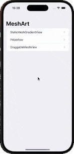

# MeshArt

MeshArt is a creative code-along project that explores custom visual effects using SwiftUI and Metal. Learn how to create and manipulate mesh gradients—from static backgrounds to interactive, draggable canvases—and apply them to text and shapes to produce stunning visual art.



## Overview

Inspired by WWDC24's [Create custom visual effects with SwiftUI](https://developer.apple.com/videos/play/wwdc2024/10151) talk, MeshArt demonstrates:
- **Static Mesh Gradients:** Define a grid of control points with corresponding colors.
- **Pride View:** Apply a stripe-based mesh gradient to text, using the colors of the pride flag.
- **Draggable Mesh Gradient:** Interactively adjust grid points to dynamically alter the gradient, with built-in reset functionality and color pickers.
- **Reusable Modifiers:** Utilize custom ViewModifiers (like `StripesModifier`) and view extensions for cleaner, reusable code.
- **Navigation Integration:** Seamlessly integrate multiple views in a `NavigationStack` with custom gesture handling (e.g., disabling the interactive pop gesture).

## Features

- **Static MeshGradient View:** Quickly set up a 3×3 grid with predetermined control points and colors.
- **Customizable PrideView:** Easily apply a stripe gradient to text with just a few lines of code.
- **Interactive DraggableMeshView:** Experiment with moving grid points to see real-time effects on your mesh gradient.
- **Reusable Stripe Modifier:** Simplify your code by using a custom modifier to apply mesh gradients as stripe effects on any view.
- **Gesture Handling:** Disable the default interactive pop gesture to ensure smooth dragging of grid points.
- **Dynamic Color Pickers:** Toggle color pickers on and off to customize gradient colors on the fly.

## Installation

1. Clone the Repository:
   ```bash
   git clone https://github.com/yourusername/MeshArt.git
   ```

2. Open in Xcode:
    - Open the `MeshArt.xcodeproj`         
    - Ensure you are using Xcode 14 or later for full SwiftUI and Metal compatibility.
        
3. Run the App:
    - Select your target device or simulator.
    - Build and run the project using **Cmd + R** or the Play button.        

## Usage

Once the app is running, navigate through the following views:

- StaticMeshGradientView: See a simple mesh gradient with a 3×3 grid.
    
- PrideView: Display large text ("Pride") styled with pride flag stripes using a mesh gradient.
    
- DraggableMeshView: Interactively drag the control points of the mesh gradient. Use the toolbar buttons to:
    - **Reset** the grid to its initial positions.
    - **Toggle** the color pickers for changing the top, middle, and bottom gradient colors.
        
    

## License

MeshArt is available under the [MIT License](LICENSE).

## Acknowledgements

- **WWDC24 Inspiration:** This project is inspired by Apple’s WWDC24 talk on creating custom visual effects with SwiftUI.
    
- **Apple Developer Documentation:** Many thanks to Apple for the detailed documentation on SwiftUI, Metal, and view modifiers.
    

---

**Stay hungry. Stay foolish.**  
— _Steve Jobs_
